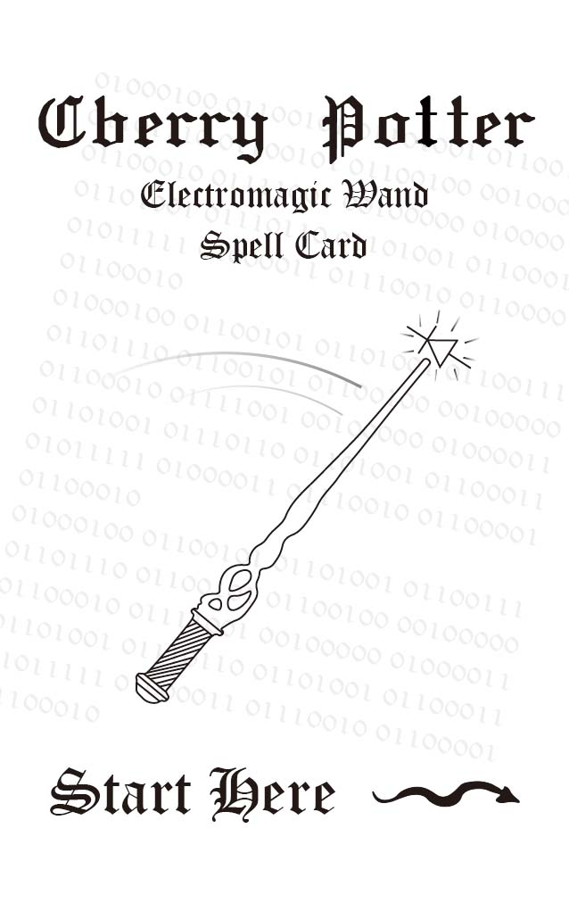
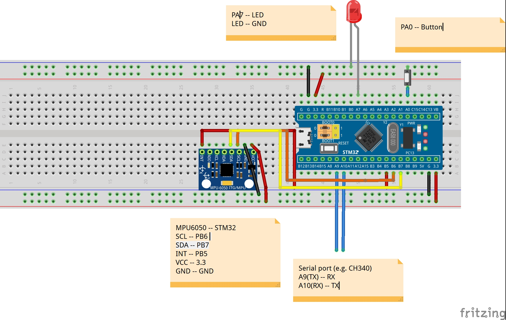

# 关于项目

此项目是Cyberry Potter Electromagic wand魔杖的基础工程

这个项目只是在魔杖开发过程中的一个片段，通过这个项目你可以用最简单易取得的硬件在Stm32上部署一个卷积神经网络动作分类模型，而不需要专门制作电路板或采购一些特别的模块。
你可以自己修改模型结构、采集数据、重新训练模型，也许这个项目可以成为你在嵌入式机器学习项目上的一个起点？

已经实现的功能有：

1. MPU6050读写数据
2. 按键控制
3. LED状态指示灯
4. 串口通信
5. 使用法术点亮、熄灭LED灯
6. 在PC端使用的[数据收集](https://github.com/lyg09270/CyberryPotter_ElectromagicWand_Basic_Project/blob/main/CNN/Serial_Read.py)、[模型训练](https://github.com/lyg09270/CyberryPotter_ElectromagicWand_Basic_Project/blob/main/CNN/CNNTrainRaw.py)、[串口模型测试脚本](https://github.com/lyg09270/CyberryPotter_ElectromagicWand_Basic_Project/blob/main/CNN/CNNTestSerialRaw.py)

项目使用的嵌入式机器学习库来自[nnom](https://github.com/majianjia/nnom)

实验用原理图：

##### 项目视频教程：[Bilibili](https://www.bilibili.com/video/BV13E421w7PY/)

在使用过程中出现问题可以在Bilibili私信我

或者联系我的邮箱：1308770968@qq.com

# 硬件需求

1. STM32f103c8t6最小系统板
2. MPU6050模块
3. 按键
4. 5个LED灯
5. 串口转TTL模块（e.g.CH340）

##### 如果想先尝试我已经训练好的模型，按照上方的原理图连接好你的单片机，打开keil进行烧录你就可以开始使用这个项目了

# 关于法术

本项目可以识别12种动作（法术），你可以将法术打印成卡片来练习法术，图片存放在了[这里](https://github.com/lyg09270/CyberryPotter_ElectromagicWand_Basic_Project/tree/main/CNN/SpellsCard)

# 环境配置

#### Python环境：

- 首先需要安装一个anaconda

  - 创建一个python3.9环境
  - `conda create --name py39_env python=3.9`
  - 激活环境
  - `conda activate py39_env`
  - 切换到工程目录的CNN文件夹
  - `cd /path/to/your/directory/CyberryPotter_ElectromagicWand_Basic_Project/CNN`
  - 安装项目依赖
  - `pip install -r requirements.txt`

  

  #### Keil环境配置：
  
  - keil版本：keil5
  
  - 编译器版本:Arm Compiler6.22
  
  - 根据你的设备选用ST-Link或其他设备作为调试器
  
  - 项目在打开keil是可能会需要安装一些库，请根据提示安装
  
    

# 如何训练

1. 使用[脚本](https://github.com/lyg09270/CyberryPotter_ElectromagicWand_Basic_Project/blob/main/CNN/Serial_Read.py)收集数据
   - 首先需要将config.h文件中的SYSTEM_MODE_DATA_COLLECT解除注释
   - 完成以上操作后单片机将进入数据打印模式而非推理模式
2. 运行[模型训练](https://github.com/lyg09270/CyberryPotter_ElectromagicWand_Basic_Project/blob/main/CNN/CNNTrainRaw.py)脚本
   - 运行训练脚本你将得到一个.h5的模型文件和一个.h的c头文件
   - .h5文件用于在[串口模型测试脚本](https://github.com/lyg09270/CyberryPotter_ElectromagicWand_Basic_Project/blob/main/CNN/CNNTestSerialRaw.py)对未量化的模型进行测试
   - .h文件是单片机用于编译模型所需要的文件

# 如何继续开发

此项目目前已经实现了动作识别的功能，并没有对其他功能进行开发，你可以在此工程的基础上对魔杖进行进一步开发
